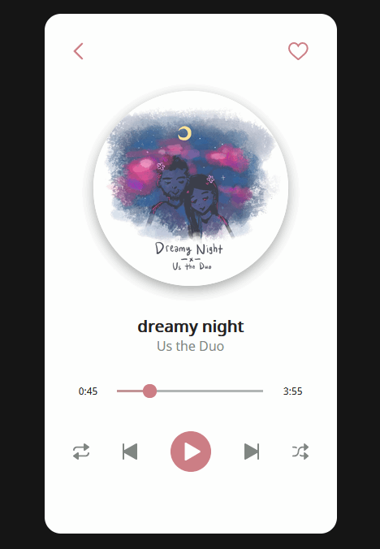

# Music Player

#### This is a minimal and simple music player UI design.

**LIVE DEMO** - [musicplayer.anniew.xyz](https://musicplayer.anniew.xyz/)

    
    
    
    
    

  

### Functionality

- Click on heart, repeat, shuffle, and play/pause button
- Drag slider on song timeline
- Play music (wip - slider does not update in real time for now)

### Designed On

- 💜 [Figma](https://www.figma.com/)

### Built With

- 💙 [HTML5](https://www.w3schools.com/html/)
- 💜 [CSS3](https://www.w3schools.com/css/)
- 💙 [JavaScript](https://www.w3schools.com/js/DEFAULT.asp)

